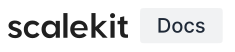

<div align="left">



<p>The open-source documentation site for Scalekit — the enterprise auth platform for B2B SaaS teams.<br />
Built with Astro + Starlight. Deployed on Netlify. Contributions very welcome.</p>

[](https://app.netlify.com/sites/scalekit-docs/deploys)
[](./LICENSE)
[](https://astro.build)
[](https://starlight.astro.build)
[](https://pnpm.io)
[](https://github.com/scalekit-inc/developer-docs/pulls)

**[📖 Read the Docs](https://docs.scalekit.com)** &nbsp;·&nbsp; **[🐛 Report an Issue](https://github.com/scalekit-inc/developer-docs/issues)** &nbsp;·&nbsp; **[💬 Join our Slack](https://join.slack.com/t/scalekit-community/shared_invite/zt-3gsxwr4hc-0tvhwT2b_qgVSIZQBQCWRw)**

</div>

---

This repository is the source for **[docs.scalekit.com](https://docs.scalekit.com)** — the official developer documentation for [Scalekit](https://scalekit.com), a complete auth stack for AI apps; be it SSO, SCIM, MCP, Agents or full-stack authentication.

Everything here — pages, guides, API references, SDK code examples, architecture concepts — lives as MDX files, rendered by the Astro + Starlight framework, and deployed continuously on Netlify. If you spot something wrong, incomplete, or missing, a pull request is always welcome.

---

### Features

- **Multi-language SDK examples** — every code sample covers Node.js, Python, Go, and Java
- **Interactive API Reference** — powered by Scalar, rendered live from the OpenAPI spec
- **Full-text search + AI Ask** — via Algolia DocSearch with conversational AI mode
- **Diagram-as-code** — architecture diagrams authored in [D2](https://d2lang.com) and rendered at build time
- **LLMs.txt support** — machine-readable docs index for AI assistants and agents
- **Edit on GitHub** — every published page links directly back to its source MDX file
- **Dark / Light mode** — with per-session persistence across page navigations

---

### Project structure

```text
developer-docs/
├── src/
│   ├── content/         # All MDX documentation pages
│   ├── components/      # Astro, React, and Vue UI components
│   ├── configs/         # Sidebar, redirects, and LLMs.txt config
│   └── styles/          # Global CSS and theme overrides
├── public/              # Static assets — images, favicons, JS widgets
├── netlify/             # Netlify serverless edge functions
├── scripts/             # Build-time utilities (search indexing, git hooks)
├── docs/                # Internal contributor reference documentation
├── astro.config.mjs     # Astro + Starlight site configuration
└── package.json
```

---

### Getting started

#### Prerequisites

- **Node.js** ≥ 18
- **pnpm** ≥ 10

```bash
npm install -g pnpm
```

#### Run locally

```bash
# 1. Clone the repository
git clone https://github.com/scalekit-inc/developer-docs.git
cd developer-docs

# 2. Install dependencies
pnpm install

# 3. Start the dev server
pnpm dev
```

Open [http://localhost:4321](http://localhost:4321). Changes to MDX files hot-reload instantly.

#### Useful Commands

| Command                      | Description                                                   |
| ---------------------------- | ------------------------------------------------------------- |
| `pnpm dev`                   | Start the site with Netlify Dev (matches deploy env)          |
| `pnpm start`                 | Run Astro dev only — use when previewing D2 diagram changes   |
| `pnpm build`                 | Build the production site to `./dist`                         |
| `pnpm preview`               | Preview the production build locally                          |
| `pnpm format`                | Auto-format all `.md`, `.mdx`, `.astro`, `.ts` files          |
| `pnpm format:check`          | Check formatting without writing changes                      |
| `pnpm generate-search-index` | Validate API deep-link URL fragments (`search-index-apis.js`) |

---

### ✍️ Contributing

We welcome contributions from everyone — whether it's fixing a typo, improving a code example, clarifying a concept, or adding a missing guide.

#### Quick Contribution Flow

1. **Fork** this repository and clone it locally
2. **Create a branch** — `git checkout -b fix/my-improvement`
3. **Edit** the relevant MDX files inside `src/content/`
4. **Format** your changes — `pnpm format`
5. **Open a Pull Request** — every page has an "Edit this page" link that takes you directly to the right file

#### Writing Standards

Before writing or editing, check:

- **`CLAUDE.md`** — the single source of truth for voice, structure, document types, and all documentation standards

**Key conventions at a glance:**

- Write in **second person** — "you", "your application"
- Use **present tense** for descriptions, **imperative** for instructions
- Every page needs `title`, `description`, `sidebar.label`, and `tags` in its frontmatter
- Code examples must cover all 4 SDK languages using `<Tabs syncKey="tech-stack">`

---

### 🧰 Tech Stack

| Layer           | Technology                                           |
| --------------- | ---------------------------------------------------- |
| Framework       | [Astro](https://astro.build) v5                      |
| Docs theme      | [Starlight](https://starlight.astro.build)           |
| UI components   | React 19, Vue 3                                      |
| Styling         | Tailwind CSS v4                                      |
| API Reference   | [Scalar](https://scalar.com)                         |
| Search          | Algolia DocSearch + AI Ask                           |
| Diagrams        | [D2](https://d2lang.com) via `astro-d2`              |
| Deployment      | [Netlify](https://netlify.com) (SSR, Edge Functions) |
| Package manager | [pnpm](https://pnpm.io) v10                          |
| Formatting      | [Prettier](https://prettier.io) + simple-git-hooks   |

---

### 🌐 Deployment

The site runs in **SSR mode on Netlify** with Edge Functions. Every push to `main` triggers a production deploy. Pull requests automatically generate isolated preview deployments.

Netlify runs **`pnpm run build`** (see `netlify.toml`). D2 is not installed on Netlify: diagram SVGs are **committed** under `public/d2/`, and the `astro-d2` integration is configured with `skipGeneration` when the `NETLIFY` environment variable is set, so CI does not run the D2 CLI.

Install the D2 CLI locally (`pnpm install:d2`) only when you **regenerate** diagrams from `.d2` sources or when you run a full local production build that is not using Netlify’s skip path. See **CONTRIBUTING.md** for how `pnpm dev` and `pnpm start` relate to diagram generation.

Environment variables required for local development are documented in `.env.example`.

---

### 📄 License

This project is licensed under the **MIT License**. See [LICENSE](./LICENSE) for the full text.

---

### 🤝 Community & Support

Have a question, idea, or just want to talk developer tooling? Come find us:

- 💬 **Slack community** — [Join the Scalekit Community](https://join.slack.com/t/scalekit-community/shared_invite/zt-3gsxwr4hc-0tvhwT2b_qgVSIZQBQCWRw)
- 🐛 **Bug reports & feature requests** — [GitHub Issues](https://github.com/scalekit-inc/developer-docs/issues)
- 🌐 **Live docs** — [docs.scalekit.com](https://docs.scalekit.com)
- 🏠 **Scalekit website** — [scalekit.com](https://scalekit.com)

---

<div align="right">
  <sub>Built with ❤️ by the <a href="https://scalekit.com">Scalekit</a> team and open-source contributors.</sub>
</div>
