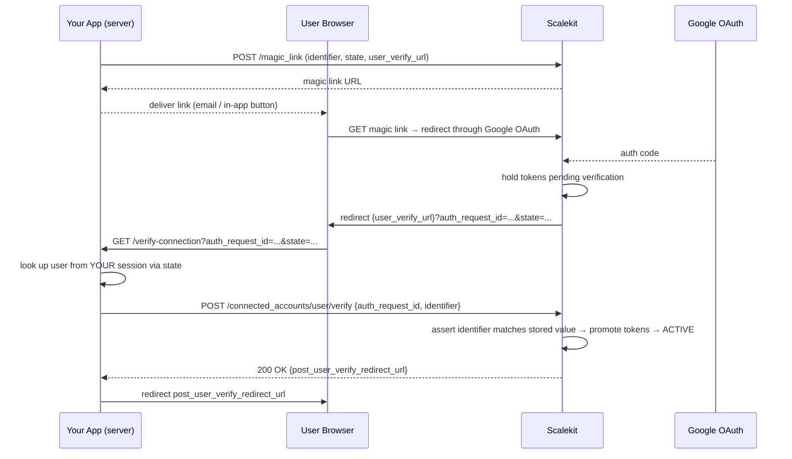

# Documentation Brief: Connected Account User Verification

**For:** Docs agent / technical writer
**Output page title:** `Secure Connected Account Auth in Production`
**Output location:** docs.scalekit.com (alongside existing agent auth docs)
**Style references:**

- https://docs.arcade.dev/en/guides/user-facing-agents/secure-auth-production — structure, tone, progressive-disclosure pattern
- https://docs.scalekit.com/agent-auth — Scalekit terminology, existing SDK patterns

---

## Page Structure

### Opening (no heading, ~3 sentences)

When a user connects their third-party account (e.g. Gmail, Google Drive), Scalekit performs a
**user verification check** to confirm the person who completed OAuth is the same person your
app intended — preventing connected account takeover attacks. Without this check, a malicious
user could share a magic link and capture another user's OAuth tokens into their own connected
account. For development, Scalekit handles verification automatically. For production, your app
owns the verify step.

---

### Section: Verification modes

Present as a two-item list before diving into each:

- **Scalekit Platform Verifier** — Scalekit verifies the user using the logged-in Scalekit
  dashboard session. No code required. Good for development and testing.
- **Custom Verifier (B2B)** — Your app controls the verify step. Required for production.
  Gives you full control over the user experience.

Configuration is per-environment via dashboard → **Environment Settings → Agent Actions**, or
via the API.

---

### Section: Use the Scalekit platform verifier

Mirror Arcade's "Use the Arcade user verifier" section in structure.

- Suitable for DEV environments; enabled by default for new workspaces (DEV).
- After the user completes OAuth, they are briefly redirected to the Scalekit platform. If the
  developer is already logged into the Scalekit dashboard, verification completes silently.
- The Scalekit dashboard includes a **playground** — test the full connected account flow
  end-to-end without writing any code.

**Callout — Limitation:**

> The platform verifier requires the developer to be logged into the Scalekit dashboard. If not
> logged in, the user sees an error page and must restart the flow.

**Callout — Production restriction:**

> `SCALEKIT_PLATFORM` mode is not available for production environments on new workspaces.
> For production, use the custom verifier.

Set the mode via API:

```http
PATCH /api/v1/environments/{id}/settings/agent-actions
Authorization: Bearer <access_token>
Content-Type: application/json

{
  "user_verify_mode": "SCALEKIT_PLATFORM"
}
```

---

### Section: Build a custom verifier (production)

Mirror Arcade's "Custom user verifier" section. This is the main how-to.

#### Step 1 — Configure your environment

Set mode to `B2B` (required for production):

```http
PATCH /api/v1/environments/{id}/settings/agent-actions
Authorization: Bearer <access_token>
Content-Type: application/json

{
  "user_verify_mode": "B2B"
}
```

#### Step 2 — Create the magic link with verification params

The following fields are required (or newly available) when `B2B` mode is active:

| Field             | Required | New?    | Description                                                                                                                                        |
| ----------------- | -------- | ------- | -------------------------------------------------------------------------------------------------------------------------------------------------- |
| `identifier`      | Yes      | No      | The user's identifier in the third-party system (e.g. email address). Scalekit stores this at link creation and asserts it matches at verify time. |
| `user_verify_url` | Yes      | **Yes** | The HTTPS URL Scalekit redirects the user to after OAuth completes.                                                                                |
| `state`           | No       | **Yes** | An opaque value to correlate the callback to your session (same pattern as OAuth `state`). Echoed back as a query param to `user_verify_url`.      |

See code samples below.

#### Step 3 — Build the verify route

Scalekit redirects the user to your `user_verify_url` after OAuth completes:

```
GET https://yourapp.com/verify-connection?auth_request_id=req_xyz&state=sess_abc123
```

Your route must:

1. Use `state` to look up the current user from **your own session**
2. Read `auth_request_id` from the query params
3. Call Scalekit's verify endpoint server-side (Step 4)

**Callout — Security rule:**

> Never read identity from query params. Always look up the user from your own session.
> The `state` param is for correlation only — not for identity.

#### Step 4 — Confirm the user's identity

Call the verify endpoint server-side with client credentials. See code samples below.

**Valid Response:**

```json
HTTP 200 OK
{
  "post_user_verify_redirect_url": "https://{env_url}/connect/success"
}
```

**Error Responses:**

| Code  | Meaning                                                            | What to do                                                              |
| ----- | ------------------------------------------------------------------ | ----------------------------------------------------------------------- |
| `400` | Missing field, or no pending verification on the connected account | Check request body; the user may need to restart the OAuth flow         |
| `403` | `identifier` mismatch — the wrong user completed the OAuth         | Do not activate. Show the user an error and have them restart the flow  |
| `404` | `auth_request_id` not found, expired, or already consumed          | The link has expired or was already used — direct the user to reconnect |

**Idempotency:** If the connected account was already activated by a previous call, Scalekit returns `200` with `post_user_verify_redirect_url` immediately, as long as the auth request still exists.

#### Step 5 — Redirect the user

Redirect the user to `post_user_verify_redirect_url`. The connected account is now active.

---

### Section: How it works (sequence diagram)



---

### Section: Migration for existing integrations

- Existing environments default to verification **disabled** — no breaking changes.
- To opt in: set `user_verify_mode` to `B2B` and update your magic link calls to add
  `user_verify_url` (required) and `state` (recommended). `identifier` was already a supported
  field — ensure it carries the user's third-party identity (e.g. their email address).
- New workspaces default to `SCALEKIT_PLATFORM` (DEV) and `B2B` (PRD). Verification cannot
  be disabled for these workspaces.

---

### Consistent terminology

| Use                        | Avoid                                             |
| -------------------------- | ------------------------------------------------- |
| connected account          | connected app                                     |
| `identifier`               | user ID, email (when referring to the field name) |
| `auth_request_id`          | request ID, flow ID                               |
| `user_verify_url`          | callback URL, redirect URL                        |
| magic link                 | magic link (lowercase)                            |
| Scalekit platform verifier | platform mode, PLATFORM                           |
| custom verifier            | B2B mode, B2B                                     |

### Do NOT document (internal implementation details)

- `ConnectedAccountState`, `castate` param, `_connstate` cookie
- `IsPlayground` flag, flagd, `PENDING_AUTH` / `PENDING_VERIFICATION` statuses
- `NONE` mode — mention only as "verification disabled for existing workspaces"
- Workspace creation time cutoffs, `user_verification_workspace_creation_time`
- Platform handler internals (`/ca/user/verify` route, `xoid`, encrypted state)

---

## Code Samples

The following samples cover both operations for all supported languages:

- **Operation A** — Create magic link with the new verification params
- **Operation B** — Verify route handler (receive redirect → confirm identity → redirect user)

> **SDK note:** `state` and `user_verify_url` are new params on the existing magic link method.
> `identifier` was already a supported field — it now carries security significance in B2B mode.
> `verifyConnectedAccountUser` is a new method added to all SDKs as part of this feature.
> Until SDKs are updated, use the curl sample for the verify call.

---

### curl

```bash
# ── Operation A: Create magic link ──────────────────────────────────────────
curl -X POST "https://{env_url}/api/v1/connected_accounts/magic_link" \
  -H "Authorization: Bearer $ACCESS_TOKEN" \
  -H "Content-Type: application/json" \
  -d '{
    "id": "ca_1234567890",
    "identifier": "alice@example.com",
    "state": "sess_abc123",
    "user_verify_url": "https://yourapp.com/verify-connection"
  }'

# Response
# {
#   "link": "https://{env_url}/magic/abc...",
#   "exp_time": "2026-03-21T12:00:00Z"
# }
# → deliver link to the user (email, in-app button, etc.)


# ── Operation B: Confirm identity (called from your verify route handler) ────
# Scalekit redirects user to:
#   GET https://yourapp.com/verify-connection?auth_request_id=req_xyz&state=sess_abc123
# Your server looks up the user email from YOUR session using `state`, then:

curl -X POST "https://{env_url}/api/v1/connected_accounts/user/verify" \
  -H "Authorization: Bearer $ACCESS_TOKEN" \
  -H "Content-Type: application/json" \
  -d '{
    "auth_request_id": "req_xyz",
    "identifier": "alice@example.com"
  }'

# Valid response (200 OK)
# {
#   "post_user_verify_redirect_url": "https://{env_url}/connect/success"
# }
# → redirect the user to post_user_verify_redirect_url
```

---

### Node.js / TypeScript

```typescript
import { ScalekitClient } from '@scalekit-sdk/node'
import express from 'express'

const scalekit = new ScalekitClient(
  process.env.SCALEKIT_ENV_URL!,
  process.env.SCALEKIT_CLIENT_ID!,
  process.env.SCALEKIT_CLIENT_SECRET!,
)

// ── Operation A: Create magic link ──────────────────────────────────────────
// Call this when your agent needs to connect a user's account
async function createMagicLink(
  connectedAccountId: string,
  userEmail: string,
  sessionId: string,
): Promise<string> {
  const response = await scalekit.actions.getAuthorizationLink({
    connectedAccountId,
    identifier: userEmail, // stored by Scalekit, asserted at verify time
    state: sessionId, // echoed back to your verify route for session correlation
    userVerifyUrl: 'https://yourapp.com/verify-connection',
  })
  return response.link // deliver this to the user (email, in-app button, etc.)
}

// ── Operation B: Verify route handler ───────────────────────────────────────
// Scalekit redirects user here after OAuth completes:
//   GET /verify-connection?auth_request_id=req_xyz&state=sess_abc123
const app = express()

app.get('/verify-connection', async (req, res) => {
  const { auth_request_id, state } = req.query as Record<string, string>

  // Look up the current user from YOUR session — never trust query params for identity
  const userEmail = await getUserEmailFromSession(state)
  if (!userEmail) {
    return res.status(401).send('Session not found')
  }

  // Confirm identity with Scalekit (server-to-server)
  try {
    const verifyResponse = await scalekit.actions.verifyConnectedAccountUser({
      authRequestId: auth_request_id,
      identifier: userEmail,
    })
    // Redirect user to the success page Scalekit returns
    return res.redirect(verifyResponse.postUserVerifyRedirectUrl)
  } catch (err: any) {
    if (err.status === 403) {
      // Identifier mismatch — wrong user completed the OAuth flow
      return res.status(403).send('Account verification failed. Please try connecting again.')
    }
    throw err
  }
})
```

---

### Python

```python
import os
from scalekit import ScalekitClient
from flask import Flask, request, redirect

scalekit = ScalekitClient(
    env_url=os.environ["SCALEKIT_ENV_URL"],
    client_id=os.environ["SCALEKIT_CLIENT_ID"],
    client_secret=os.environ["SCALEKIT_CLIENT_SECRET"],
)

# ── Operation A: Create magic link ──────────────────────────────────────────
# Call this when your agent needs to connect a user's account
def create_magic_link(connected_account_id: str, user_email: str, session_id: str) -> str:
    response = scalekit.actions.get_authorization_link(
        connected_account_id=connected_account_id,
        identifier=user_email,       # stored by Scalekit, asserted at verify time
        state=session_id,            # echoed back to your verify route for session correlation
        user_verify_url="https://yourapp.com/verify-connection",
    )
    return response.link  # deliver this to the user (email, in-app button, etc.)


# ── Operation B: Verify route handler ───────────────────────────────────────
# Scalekit redirects user here after OAuth completes:
#   GET /verify-connection?auth_request_id=req_xyz&state=sess_abc123
app = Flask(__name__)

@app.route("/verify-connection")
def verify_connection():
    auth_request_id = request.args.get("auth_request_id")
    state = request.args.get("state")

    # Look up the current user from YOUR session — never trust query params for identity
    user_email = get_user_email_from_session(state)
    if not user_email:
        return "Session not found", 401

    # Confirm identity with Scalekit (server-to-server)
    try:
        verify_response = scalekit.actions.verify_connected_account_user(
            auth_request_id=auth_request_id,
            identifier=user_email,
        )
    except scalekit.ScalekitException as e:
        if e.status_code == 403:
            # Identifier mismatch — wrong user completed the OAuth flow
            return "Account verification failed. Please try connecting again.", 403
        raise

    # Redirect user to the success page Scalekit returns
    return redirect(verify_response.post_user_verify_redirect_url)
```

---

### Go

```go
package main

import (
    "context"
    "net/http"
    "os"

    scalekit "github.com/scalekit-inc/scalekit-sdk-go/v2"
)

var sk = scalekit.NewScalekitClient(
    os.Getenv("SCALEKIT_ENV_URL"),
    os.Getenv("SCALEKIT_CLIENT_ID"),
    os.Getenv("SCALEKIT_CLIENT_SECRET"),
)

// ── Operation A: Create magic link ──────────────────────────────────────────
// Call this when your agent needs to connect a user's account
func createMagicLink(ctx context.Context, connectedAccountID, userEmail, sessionID string) (string, error) {
    resp, err := sk.Actions().GetAuthorizationLink(ctx, scalekit.GetAuthorizationLinkOptions{
        ConnectedAccountID: connectedAccountID,
        Identifier:         userEmail,    // stored by Scalekit, asserted at verify time
        State:              sessionID,    // echoed back to your verify route for session correlation
        UserVerifyURL:      "https://yourapp.com/verify-connection",
    })
    if err != nil {
        return "", err
    }
    return resp.Link, nil // deliver this to the user (email, in-app button, etc.)
}

// ── Operation B: Verify route handler ───────────────────────────────────────
// Scalekit redirects user here after OAuth completes:
//   GET /verify-connection?auth_request_id=req_xyz&state=sess_abc123
func verifyConnectionHandler(w http.ResponseWriter, r *http.Request) {
    authRequestID := r.URL.Query().Get("auth_request_id")
    state := r.URL.Query().Get("state")

    // Look up the current user from YOUR session — never trust query params for identity
    userEmail, err := getUserEmailFromSession(r, state)
    if err != nil || userEmail == "" {
        http.Error(w, "session not found", http.StatusUnauthorized)
        return
    }

    // Confirm identity with Scalekit (server-to-server)
    verifyResp, err := sk.Actions().VerifyConnectedAccountUser(r.Context(), scalekit.VerifyConnectedAccountUserOptions{
        AuthRequestID: authRequestID,
        Identifier:    userEmail,
    })
    if err != nil {
        if scalekit.IsStatusError(err, http.StatusForbidden) {
            // Identifier mismatch — wrong user completed the OAuth flow
            http.Error(w, "Account verification failed. Please try connecting again.", http.StatusForbidden)
            return
        }
        http.Error(w, "verification failed", http.StatusInternalServerError)
        return
    }

    // Redirect user to the success page Scalekit returns
    http.Redirect(w, r, verifyResp.PostUserVerifyRedirectURL, http.StatusFound)
}
```

---

### Java

```java
import com.scalekit.ScalekitClient;
import com.scalekit.actions.GetAuthorizationLinkOptions;
import com.scalekit.actions.VerifyConnectedAccountUserOptions;
import org.springframework.web.bind.annotation.*;
import jakarta.servlet.http.HttpServletRequest;
import jakarta.servlet.http.HttpServletResponse;
import java.io.IOException;

@RestController
public class ConnectedAccountController {

    private final ScalekitClient scalekit = new ScalekitClient(
        System.getenv("SCALEKIT_ENV_URL"),
        System.getenv("SCALEKIT_CLIENT_ID"),
        System.getenv("SCALEKIT_CLIENT_SECRET")
    );

    // ── Operation A: Create magic link ──────────────────────────────────────
    // Call this when your agent needs to connect a user's account
    public String createMagicLink(String connectedAccountId, String userEmail, String sessionId) {
        var response = scalekit.actions().getAuthorizationLink(
            GetAuthorizationLinkOptions.builder()
                .connectedAccountId(connectedAccountId)
                .identifier(userEmail)       // stored by Scalekit, asserted at verify time
                .state(sessionId)            // echoed back to your verify route for session correlation
                .userVerifyUrl("https://yourapp.com/verify-connection")
                .build()
        );
        return response.getLink(); // deliver this to the user (email, in-app button, etc.)
    }

    // ── Operation B: Verify route handler ───────────────────────────────────
    // Scalekit redirects user here after OAuth completes:
    //   GET /verify-connection?auth_request_id=req_xyz&state=sess_abc123
    @GetMapping("/verify-connection")
    public void verifyConnection(
        @RequestParam("auth_request_id") String authRequestId,
        @RequestParam("state") String state,
        HttpServletRequest request,
        HttpServletResponse response
    ) throws IOException {
        // Look up the current user from YOUR session — never trust query params for identity
        String userEmail = getUserEmailFromSession(request, state);
        if (userEmail == null) {
            response.sendError(HttpServletResponse.SC_UNAUTHORIZED, "Session not found");
            return;
        }

        // Confirm identity with Scalekit (server-to-server)
        try {
            var verifyResponse = scalekit.actions().verifyConnectedAccountUser(
                VerifyConnectedAccountUserOptions.builder()
                    .authRequestId(authRequestId)
                    .identifier(userEmail)
                    .build()
            );
            // Redirect user to the success page Scalekit returns
            response.sendRedirect(verifyResponse.getPostUserVerifyRedirectUrl());
        } catch (ScalekitException e) {
            if (e.getStatusCode() == 403) {
                // Identifier mismatch — wrong user completed the OAuth flow
                response.sendError(HttpServletResponse.SC_FORBIDDEN,
                    "Account verification failed. Please try connecting again.");
                return;
            }
            throw e;
        }
    }
}
```

---

## SDK changes required (for SDK team)

The following changes are needed in all four SDKs before code samples go live.

### New params on existing magic link method

`identifier` already exists in the Node.js and Python SDKs. Only `state` and `user_verify_url`
are new additions. `identifier` must now be set explicitly for B2B verification to work.

| Language | Method                             | New params to add                          | Existing params now required |
| -------- | ---------------------------------- | ------------------------------------------ | ---------------------------- |
| Node.js  | `actions.getAuthorizationLink()`   | `state`, `userVerifyUrl`                   | `identifier`                 |
| Python   | `actions.get_authorization_link()` | `state`, `user_verify_url`                 | `identifier`                 |
| Go       | `Actions().GetAuthorizationLink()` | `State`, `UserVerifyURL` in options struct | `Identifier`                 |
| Java     | `actions().getAuthorizationLink()` | `.state()`, `.userVerifyUrl()` on builder  | `.identifier()`              |

### New method: verify connected account user

Wraps `POST {env_url}/api/v1/connected_accounts/user/verify`.

| Language | Method signature                                                                                                                                             |
| -------- | ------------------------------------------------------------------------------------------------------------------------------------------------------------ |
| Node.js  | `actions.verifyConnectedAccountUser({ authRequestId, identifier })` → `{ postUserVerifyRedirectUrl }`                                                        |
| Python   | `actions.verify_connected_account_user(auth_request_id, identifier)` → `.post_user_verify_redirect_url`                                                      |
| Go       | `Actions().VerifyConnectedAccountUser(ctx, VerifyConnectedAccountUserOptions{ AuthRequestID, Identifier })` → `.PostUserVerifyRedirectURL`                   |
| Java     | `actions().verifyConnectedAccountUser(VerifyConnectedAccountUserOptions.builder().authRequestId().identifier().build())` → `.getPostUserVerifyRedirectUrl()` |
