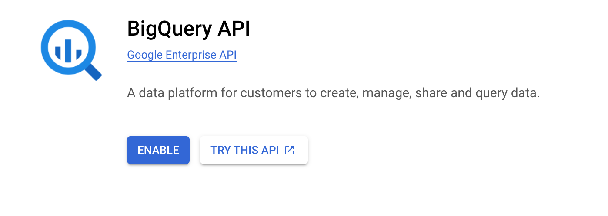

import { Steps } from '@astrojs/starlight/components'

To connect a BigQuery account programmatically, you need a GCP service account JSON key. Here's how to get one:

<Steps>
1. ### Create a GCP service account

    - Go to [Google Cloud Console](https://console.cloud.google.com) → **IAM & Admin** → **Service Accounts**.
    - Click **+ Create Service Account**, enter a name and description, and click **Create and Continue**.
    - Grant the service account the **BigQuery Data Viewer**, **BigQuery Data Editor**, and **BigQuery Job User** roles, then click **Done**.

2. ### Enable the BigQuery API

    - In [Google Cloud Console](https://console.cloud.google.com), go to **APIs & Services** → **Library**.
    - Search for **BigQuery API** and click **Enable**.

      

3. ### Download the service account JSON key

    - In the Service Accounts list, click on your service account.
    - Go to the **Keys** tab → **Add Key** → **Create new key**.
    - Select **JSON** and click **Create**. The key file downloads automatically.
    - Use the contents of this file as the `service_account_json` value when creating a connected account.
</Steps>
