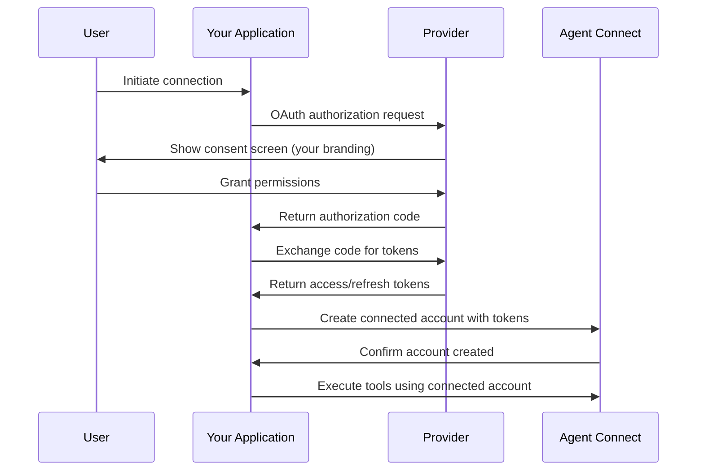

import { Card, CardGrid, Aside, Steps, Tabs, TabItem } from '@astrojs/starlight/components';

Bring Your Own Authentication (BYOA) allows you to use your own OAuth applications and authentication credentials with Agent Connect instead of Scalekit's shared credentials. This provides complete control over the authentication experience and enables full whitelabeling of your application.

## Why bring your own authentication?

### Complete whitelabeling

When you use your own OAuth credentials, users see your application name and branding throughout the authentication flow instead of Scalekit's:

- **OAuth consent screens** display your app name and logo
- **Authorization URLs** use your domain and branding
- **Email notifications** from providers reference your application
- **User permissions** are granted directly to your application

### Enhanced security and control

- **Direct relationship**: Maintain direct OAuth relationships with providers
- **Full audit trail**: Complete visibility into authentication flows and user consent
- **Custom verification**: Complete OAuth app verification with your company details
- **Compliance control**: Meet regulatory requirements for direct provider relationships

### Production-grade capabilities

- **Dedicated quotas**: Avoid sharing rate limits with other Scalekit customers
- **Higher limits**: Access provider-specific quota increases for your application
- **Priority support**: Direct support relationships with OAuth providers
- **Custom integrations**: Build provider-specific customizations

## How BYOA works

### Architecture overview

With BYOA, authentication flows work as follows:

1. **Your OAuth app** handles the initial authentication request
2. **Provider** authenticates the user and returns tokens to your app
3. **Your application** securely shares tokens with Agent Connect
4. **Agent Connect** uses your tokens to execute tools on behalf of users

### Token flow



## Setting up BYOA

### Step 1: Create OAuth applications

Create OAuth applications with each provider you want to support:

<Tabs>
<TabItem value="google" label="Google">

<Steps>
1. **Create project** in [Google Cloud Console](https://console.cloud.google.com/)
2. **Enable APIs** for the services you'll use (Gmail, Calendar, etc.)
3. **Create OAuth consent screen** with your company branding
4. **Create OAuth 2.0 credentials** for your application
5. **Configure redirect URIs** for your application
6. **Submit for verification** if using sensitive scopes
</Steps>

**Key settings:**
- **Application type**: Web application
- **Authorized redirect URIs**: Your application's callback URLs
- **Scopes**: Minimum scopes needed for your use case

</TabItem>
<TabItem value="microsoft" label="Microsoft">

<Steps>
1. **Register application** in [Azure Portal](https://portal.azure.com/)
2. **Configure authentication** with your redirect URIs
3. **Set API permissions** for Microsoft Graph
4. **Create client secret** for server-to-server authentication
5. **Configure branding** with your company details
6. **Submit for admin consent** if using privileged scopes
</Steps>

**Key settings:**
- **Supported account types**: Accounts in any organizational directory
- **Redirect URIs**: Web platform with your callback URLs
- **API permissions**: Microsoft Graph delegated permissions

</TabItem>
<TabItem value="slack" label="Slack">

<Steps>
1. **Create Slack app** in [Slack API portal](https://api.slack.com/apps)
2. **Configure OAuth settings** with your redirect URLs
3. **Set OAuth scopes** for your application needs
4. **Configure app manifest** with your branding
5. **Distribute to workspace** or submit to Slack App Directory
</Steps>

**Key settings:**
- **OAuth scopes**: Bot token scopes and user token scopes
- **Redirect URLs**: Your application's OAuth callback endpoints
- **App manifest**: Display information and branding

</TabItem>
</Tabs>

### Step 2: Configure connections in Agent Connect

Create connections in Agent Connect that use your OAuth credentials:

<Tabs>
<TabItem value="dashboard" label="Dashboard">

1. Navigate to **Connections** in Agent Connect dashboard
2. Click **Create Connection**
3. Select the provider (Google, Microsoft, Slack, etc.)
4. Choose **"Use your own OAuth credentials"**
5. Enter your OAuth application details:
   - Client ID
   - Client Secret
   - Redirect URI (if different from default)
   - Custom scopes (if needed)
6. Save and test the connection

</TabItem>
<TabItem value="api" label="API">

```javascript
const connection = await agentConnect.connections.create({
  provider: 'google',
  auth_type: 'oauth2',
  auth_mode: 'bring_your_own',
  credentials: {
    client_id: 'your-google-client-id',
    client_secret: 'your-google-client-secret',
    redirect_uri: 'https://your-app.com/oauth/callback'
  },
  scopes: [
    'https://www.googleapis.com/auth/gmail.send',
    'https://www.googleapis.com/auth/calendar.readonly'
  ],
  settings: {
    auto_refresh: true,
    token_storage: 'agent_connect'
  }
});
```

</TabItem>
</Tabs>

### Step 3: Implement authentication flow

Implement the OAuth flow in your application:

<Tabs>
<TabItem value="javascript" label="JavaScript">

```javascript
// 1. Redirect user to OAuth provider
app.get('/connect/:provider', async (req, res) => {
  const { provider } = req.params;
  const { user_id } = req.query;
  
  // Create connected account in Agent Connect
  const connectedAccount = await agentConnect.accounts.create({
    connection_id: `conn_${provider}`,
    identifier: user_id,
    identifier_type: 'user_id'
  });
  
  // Generate OAuth URL using your credentials
  const authUrl = await agentConnect.accounts.getAuthUrl(connectedAccount.id, {
    state: JSON.stringify({ user_id, account_id: connectedAccount.id })
  });
  
  res.redirect(authUrl);
});

// 2. Handle OAuth callback
app.get('/oauth/callback', async (req, res) => {
  const { code, state, error } = req.query;
  
  if (error) {
    return res.status(400).json({ error: error });
  }
  
  const { user_id, account_id } = JSON.parse(state);
  
  try {
    // Exchange code for tokens through Agent Connect
    const result = await agentConnect.accounts.exchangeCode(
      account_id,
      code,
      state
    );
    
    // Account is now active and ready for tool execution
    res.json({ 
      success: true,
      account_id: account_id,
      status: result.status
    });
  } catch (err) {
    res.status(500).json({ error: err.message });
  }
});
```

</TabItem>
<TabItem value="python" label="Python">

```python
from flask import Flask, request, redirect, jsonify
import json

app = Flask(__name__)

@app.route('/connect/<provider>')
def connect_provider(provider):
    user_id = request.args.get('user_id')
    
    # Create connected account in Agent Connect
    connected_account = agent_connect.accounts.create(
        connection_id=f'conn_{provider}',
        identifier=user_id,
        identifier_type='user_id'
    )
    
    # Generate OAuth URL using your credentials
    auth_url = agent_connect.accounts.get_auth_url(
        connected_account.id,
        state=json.dumps({
            'user_id': user_id,
            'account_id': connected_account.id
        })
    )
    
    return redirect(auth_url)

@app.route('/oauth/callback')
def oauth_callback():
    code = request.args.get('code')
    state = request.args.get('state')
    error = request.args.get('error')
    
    if error:
        return jsonify({'error': error}), 400
    
    state_data = json.loads(state)
    user_id = state_data['user_id']
    account_id = state_data['account_id']
    
    try:
        # Exchange code for tokens through Agent Connect
        result = agent_connect.accounts.exchange_code(
            account_id,
            code,
            state
        )
        
        # Account is now active and ready for tool execution
        return jsonify({
            'success': True,
            'account_id': account_id,
            'status': result.status
        })
    except Exception as e:
        return jsonify({'error': str(e)}), 500
```

</TabItem>
</Tabs>

## Token management strategies

### Strategy 1: Agent Connect managed

Let Agent Connect handle token storage and refresh:

```javascript
const connection = await agentConnect.connections.create({
  provider: 'google',
  auth_mode: 'bring_your_own',
  credentials: {
    client_id: 'your-client-id',
    client_secret: 'your-client-secret'
  },
  settings: {
    token_storage: 'agent_connect',
    auto_refresh: true
  }
});
```

**Benefits:**
- Agent Connect handles token refresh automatically
- No need to implement token storage in your application
- Tokens are encrypted and securely stored

**Considerations:**
- Tokens are stored in Agent Connect's infrastructure
- Less control over token lifecycle

### Strategy 2: Your application managed

Manage tokens in your own application:

```javascript
// Store tokens in your application after OAuth flow
const storeTokens = async (userId, tokens) => {
  await yourDatabase.tokens.create({
    user_id: userId,
    access_token: encrypt(tokens.access_token),
    refresh_token: encrypt(tokens.refresh_token),
    expires_at: tokens.expires_at
  });
};

// Provide tokens to Agent Connect when executing tools
const executeWithTokens = async (toolRequest) => {
  const tokens = await yourDatabase.tokens.find({ user_id: toolRequest.user_id });
  
  return await agentConnect.tools.execute({
    ...toolRequest,
    tokens: {
      access_token: decrypt(tokens.access_token),
      refresh_token: decrypt(tokens.refresh_token)
    }
  });
};
```

**Benefits:**
- Complete control over token storage and lifecycle
- Tokens remain in your infrastructure
- Custom token refresh logic

**Considerations:**
- More complex implementation
- Responsibility for secure token storage
- Need to implement token refresh logic

### Strategy 3: Hybrid approach

Combine both approaches for maximum flexibility:

```javascript
const connection = await agentConnect.connections.create({
  provider: 'google',
  auth_mode: 'bring_your_own',
  credentials: {
    client_id: 'your-client-id',
    client_secret: 'your-client-secret'
  },
  settings: {
    token_storage: 'hybrid',
    auto_refresh: true,
    webhook_url: 'https://your-app.com/webhooks/token-refresh'
  }
});
```

## Advanced configuration

### Custom scopes per user

Configure different scopes for different users:

```javascript
// Create connected account with custom scopes
const connectedAccount = await agentConnect.accounts.create({
  connection_id: 'conn_google',
  identifier: 'premium_user_123',
  identifier_type: 'user_id',
  scopes: [
    'https://www.googleapis.com/auth/gmail.send',
    'https://www.googleapis.com/auth/calendar.readonly',
    'https://www.googleapis.com/auth/drive.file'  // Premium feature
  ]
});
```

### Domain-specific configuration

Configure different settings for different domains:

```javascript
const connections = await Promise.all([
  // Configuration for example.com domain
  agentConnect.connections.create({
    provider: 'google',
    auth_mode: 'bring_your_own',
    credentials: {
      client_id: 'example-com-client-id',
      client_secret: 'example-com-client-secret'
    },
    settings: {
      domain_restriction: 'example.com',
      hd_parameter: 'example.com'  // Google hosted domain
    }
  }),
  
  // Configuration for partner.com domain
  agentConnect.connections.create({
    provider: 'google',
    auth_mode: 'bring_your_own',
    credentials: {
      client_id: 'partner-com-client-id',
      client_secret: 'partner-com-client-secret'
    },
    settings: {
      domain_restriction: 'partner.com',
      hd_parameter: 'partner.com'
    }
  })
]);
```

### Environment-specific configuration

Separate configurations for different environments:

```javascript
const getConnectionConfig = (environment) => {
  const configs = {
    development: {
      client_id: process.env.DEV_GOOGLE_CLIENT_ID,
      client_secret: process.env.DEV_GOOGLE_CLIENT_SECRET,
      redirect_uri: 'http://localhost:3000/oauth/callback'
    },
    staging: {
      client_id: process.env.STAGING_GOOGLE_CLIENT_ID,
      client_secret: process.env.STAGING_GOOGLE_CLIENT_SECRET,
      redirect_uri: 'https://staging.yourapp.com/oauth/callback'
    },
    production: {
      client_id: process.env.PROD_GOOGLE_CLIENT_ID,
      client_secret: process.env.PROD_GOOGLE_CLIENT_SECRET,
      redirect_uri: 'https://yourapp.com/oauth/callback'
    }
  };
  
  return configs[environment];
};
```

## Security considerations

### Credential protection

Protect your OAuth credentials:

- **Environment variables**: Store credentials in environment variables
- **Secret management**: Use secret management systems (AWS Secrets Manager, Azure Key Vault)
- **Rotation**: Implement regular credential rotation
- **Access control**: Limit access to credential management
- **Monitoring**: Monitor credential usage and access

### Token security

Secure token handling:

- **Encryption**: Encrypt tokens at rest
- **Transmission**: Use HTTPS for all token transmission
- **Storage**: Use secure storage mechanisms
- **Expiration**: Implement proper token expiration
- **Revocation**: Provide token revocation capabilities

### OAuth security

Follow OAuth security best practices:

- **PKCE**: Use Proof Key for Code Exchange for public clients
- **State parameter**: Always use state parameter to prevent CSRF
- **Scope limitation**: Request minimal necessary scopes
- **Redirect URI validation**: Validate redirect URIs strictly
- **Code exchange**: Exchange authorization codes server-side only

## Monitoring and analytics

### Authentication metrics

Monitor authentication flows:

```javascript
// Track authentication success rates
const authMetrics = await agentConnect.analytics.getAuthMetrics({
  connection_id: 'conn_google',
  period: '30d',
  metrics: ['success_rate', 'error_rate', 'completion_time']
});

// Monitor token refresh rates
const tokenMetrics = await agentConnect.analytics.getTokenMetrics({
  connection_id: 'conn_google',
  period: '7d',
  metrics: ['refresh_rate', 'expiration_rate', 'failure_rate']
});
```

### Usage analytics

Track how users interact with your OAuth applications:

```javascript
// Get usage statistics
const usage = await agentConnect.analytics.getUsage({
  connection_id: 'conn_google',
  group_by: 'tool',
  period: '30d'
});

// Monitor rate limit usage
const rateLimits = await agentConnect.analytics.getRateLimits({
  connection_id: 'conn_google',
  period: '24h'
});
```

## Troubleshooting BYOA

### Common issues

**OAuth consent screen shows wrong information:**
- Verify OAuth application configuration
- Check app verification status
- Ensure proper branding is configured

**Token refresh failures:**
- Verify refresh token is valid
- Check OAuth application permissions
- Ensure client credentials are correct

**Rate limit errors:**
- Check your OAuth application quotas
- Monitor usage patterns
- Request quota increases if needed

### Debug tools

Use Agent Connect's debug tools to troubleshoot:

```javascript
// Debug authentication flow
const debugInfo = await agentConnect.debug.getAuthFlow({
  connected_account_id: 'account_123',
  include_tokens: false,  // Don't include sensitive data
  include_requests: true
});

// Test connection configuration
const testResult = await agentConnect.debug.testConnection({
  connection_id: 'conn_google',
  test_account_id: 'test_account_123'
});
```

## Best practices

### OAuth application management

- **Separate applications**: Use different OAuth apps for different environments
- **Proper naming**: Use clear, descriptive names for OAuth applications
- **Documentation**: Maintain documentation of OAuth application configurations
- **Monitoring**: Monitor OAuth application health and usage

### Token lifecycle management

- **Proactive refresh**: Refresh tokens before they expire
- **Error handling**: Implement robust error handling for token operations
- **Backup strategy**: Have backup plans for token refresh failures
- **User communication**: Communicate token status to users clearly

### Security practices

- **Regular audits**: Audit OAuth applications and permissions regularly
- **Least privilege**: Grant minimum necessary permissions
- **Monitoring**: Monitor for suspicious authentication patterns
- **Incident response**: Have incident response plans for security issues

## Migration from shared credentials

If you're currently using Scalekit's shared credentials and want to migrate to BYOA:

<Steps>
1. **Create OAuth applications** with each provider
2. **Set up BYOA connections** in Agent Connect
3. **Test authentication flows** in development
4. **Migrate users gradually** using feature flags
5. **Monitor migration progress** and handle issues
6. **Complete migration** and disable shared credentials
</Steps>

<Aside type="note">
**Migration considerations:**
- Users will need to re-authenticate with your OAuth applications
- OAuth consent screens will change to show your branding
- Rate limits and quotas will change to your application's limits
- Some users may need to re-grant permissions
</Aside>

## Getting support

For help with BYOA implementation:

- **Provider documentation**: Refer to each provider's OAuth documentation
- **Agent Connect support**: Contact Scalekit support for BYOA assistance
- **Community forums**: Join discussions about BYOA best practices
- **Professional services**: Consider professional services for complex implementations

By implementing Bring Your Own Authentication, you gain complete control over your users' authentication experience while maintaining the power and flexibility of Agent Connect's unified API for tool execution.