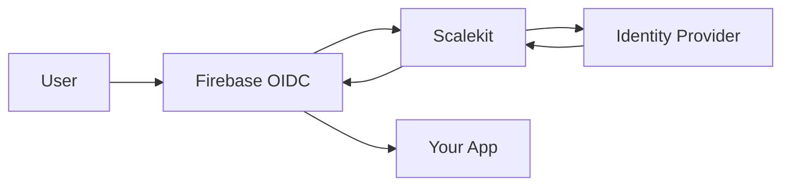

import { Aside, Steps, Tabs, TabItem } from '@astrojs/starlight/components'

This guide explains how to integrate Scalekit with Firebase applications for enterprise Single Sign-On (SSO) authentication. You'll learn two distinct approaches based on your Firebase Authentication setup.


## Before you begin

Review your Firebase Authentication setup to determine which integration approach suits your application:

- **Option 1**: Requires Firebase Authentication with Identity Platform (paid tier)
- **Option 2**: Works with Legacy Firebase Authentication (free tier)

You also need:
- Access to a <a href="https://app.scalekit.com" target="_blank">Scalekit account</a>
- Firebase project with Authentication enabled
- Basic understanding of [Firebase Admin SDK](https://firebase.google.com/docs/reference/admin) (for Option 2)

Checkout our [example app](https://github.com/scalekit-developers/nodejs-example-apps/) for a complete implementation.

## Option 1: Configure Scalekit as an OIDC Provider

Use this approach if you have **Firebase Authentication with Identity Platform**. Firebase acts as an OpenID Connect (OIDC) relying party that integrates directly with Scalekit.

<Aside type="note">
OpenID Connect providers are not available in Legacy Firebase Authentication. See the <a href="https://cloud.google.com/identity-platform/docs/product-comparison" target="_blank">Firebase product comparison</a> for details.
</Aside>



Firebase handles the OAuth 2.0 flow automatically using its built-in OIDC provider support.

<Steps>

1. #### Configure Firebase to accept Scalekit as an identity provider

   Log in to the <a href="https://console.firebase.google.com/" target="_blank">Firebase Console</a> and navigate to your project.

   - Go to **Authentication** > **Sign-in method**
   - Click **Add new provider** and select **OpenID Connect**
   - Set the **Name** to "Scalekit"
   - Choose **Code flow** for the **Grant Type**

   

2. #### Copy your Scalekit API credentials

   In your Scalekit Dashboard, navigate to **Settings** > **API Config** and copy these values:

   - **Client ID**: Your Scalekit application identifier
   - **Environment URL**: Your Scalekit environment (e.g., `https://your-subdomain.scalekit.dev`)
   - **Client Secret**: Generate a new secret if needed

   

3. #### Connect Firebase to Scalekit using your API credentials

   In Firebase Console, paste the Scalekit values into the corresponding fields:

   - **Client ID**: Paste your Scalekit Client ID
   - **Issuer URL**: Paste your Scalekit Environment URL
   - **Client Secret**: Paste your Scalekit Client Secret

   

4. #### Allow Firebase to redirect users back to your app

   Copy the **Callback URL** from your Firebase OIDC Integration settings.

   

   Add this URL as a **Redirect URI** in your Scalekit API Config.

   

5. #### Add SSO login to your frontend code

   Use Firebase's standard OIDC authentication in your frontend:

   ```javascript title="Login Implementation"
   import { getAuth, OAuthProvider, signInWithPopup } from 'firebase/auth';

   const auth = getAuth();

   // Initialize Scalekit as an OIDC provider
   const scalekitProvider = new OAuthProvider('oidc.scalekit');

   // Set SSO parameters
   scalekitProvider.setCustomParameters({
     domain: 'customer@company.com', // or organization_id, connection_id
   });

   // Handle SSO login
   const loginButton = document.getElementById('sso-login');
   loginButton.onclick = async () => {
     try {
       const result = await signInWithPopup(auth, scalekitProvider);
       const user = result.user;

       console.log('Authenticated user:', user.email);
       // User is now signed in to Firebase
     } catch (error) {
       console.error('Authentication failed:', error);
     }
   };
   ```

</Steps>

## Option 2: Direct SSO with Custom Tokens

Use this approach if you have **Legacy Firebase Authentication** or need full control over the authentication flow. Your backend integrates directly with Scalekit and creates custom Firebase tokens.

<details>
<summary>View authentication flow summary</summary>

```mermaid wrap showLineNumbers=false title="How it works"
1. User clicks "Sign In"
   ↓
2. Frontend calls backend → Backend generates Scalekit auth URL
   ↓
3. Frontend redirects to Scalekit auth URL
   ↓
4. Scalekit redirects to Identity Provider
   ↓
5. User authenticates with IdP
   ↓
6. IdP redirects back to Scalekit
   ↓
7. Scalekit redirects to your backend callback URL with code
   ↓
8. Backend exchanges code for user profile with Scalekit
   ↓
9. Backend creates custom Firebase token
   ↓
10. Backend returns custom token to frontend
    ↓
11. Frontend calls signInWithCustomToken(firebase, customToken)
    ↓
12. Firebase creates/updates user and returns Firebase user object
    ↓
13. User is authenticated and can access your app!
```
</details>

Your backend handles SSO authentication and creates custom tokens for Firebase.

<Steps>

1. #### Install Scalekit and Firebase Admin SDKs

   Install the Scalekit SDK and configure your backend server with Firebase Admin SDK:

   ```bash
   npm install @scalekit-sdk/node firebase-admin
   ```

   ```javascript title="backend/server.js"
   import { ScalekitClient } from '@scalekit-sdk/node';
   import admin from 'firebase-admin';

   // Initialize Scalekit
   const scalekit = new ScalekitClient(
     process.env.SCALEKIT_ENVIRONMENT_URL,
     process.env.SCALEKIT_CLIENT_ID,
     process.env.SCALEKIT_CLIENT_SECRET
   );

   // Initialize Firebase Admin
   ```

2. #### Handle SSO callback and create Firebase tokens

   Implement the SSO callback handler that exchanges the authorization code for user details and creates custom Firebase tokens:

   ```javascript title="SSO Callback Handler"
   app.get('/auth/callback', async (req, res) => {
     const { code, error, error_description } = req.query;

     if (error) {
       return res.status(400).json({
         error: 'Authentication failed',
         details: error_description
       });
     }

     try {
       // Exchange code for user profile
       const result = await scalekit.authenticateWithCode(
         code,
         'https://your-app.com/auth/callback'
       );

       const user = result.user;

       // Create custom Firebase token
       const customToken = await admin.auth().createCustomToken(user.id, {
         email: user.email,
         name: `${user.givenName} ${user.familyName}`,
         organizationId: user.organizationId,
       });

       res.json({
         customToken,
         user: {
           email: user.email,
           name: `${user.givenName} ${user.familyName}`,
         }
       });
     } catch (error) {
       console.error('SSO authentication failed:', error);
       res.status(500).json({ error: 'Internal server error' });
     }
   });
   ```

3. #### Generate authorization URL to initiate SSO

   Create an endpoint to generate Scalekit authorization URLs:

   <Tabs syncKey="backend-language">
   <TabItem value="nodejs" label="Node.js">

   ```javascript title="Authorization URL Endpoint"
   app.post('/auth/start-sso', async (req, res) => {
     const { organizationId, domain, connectionId } = req.body;

     try {
       const options = {};
       if (organizationId) options.organizationId = organizationId;
       if (domain) options.domain = domain;
       if (connectionId) options.connectionId = connectionId;

       const authorizationUrl = scalekit.getAuthorizationUrl(
         'https://your-app.com/auth/callback',
         options
       );

       res.json({ authorizationUrl });
     } catch (error) {
       console.error('Failed to generate authorization URL:', error);
       res.status(500).json({ error: 'Internal server error' });
     }
   });
   ```

   </TabItem>
   <TabItem value="python" label="Python">

   ```python title="Authorization URL Endpoint"
   @app.route('/auth/start-sso', methods=['POST'])
   def start_sso():
       data = request.get_json()
       organization_id = data.get('organizationId')
       domain = data.get('domain')
       connection_id = data.get('connectionId')

       try:
           options = {}
           if organization_id:
               options['organization_id'] = organization_id
           if domain:
               options['domain'] = domain
           if connection_id:
               options['connection_id'] = connection_id

           authorization_url = scalekit.get_authorization_url(
               'https://your-app.com/auth/callback',
               options
           )

           return jsonify({'authorizationUrl': authorization_url})
       except Exception as e:
           print(f'Failed to generate authorization URL: {e}')
           return jsonify({'error': 'Internal server error'}), 500
   ```

   </TabItem>
   <TabItem value="golang" label="Go">

   ```go title="Authorization URL Endpoint"
   func startSSOHandler(w http.ResponseWriter, r *http.Request) {
       var requestData struct {
           OrganizationID string `json:"organizationId"`
           Domain         string `json:"domain"`
           ConnectionID   string `json:"connectionId"`
       }

       if err := json.NewDecoder(r.Body).Decode(&requestData); err != nil {
           http.Error(w, "Invalid request body", http.StatusBadRequest)
           return
       }

       options := scalekit.AuthorizationUrlOptions{}
       if requestData.OrganizationID != "" {
           options.OrganizationId = requestData.OrganizationID
       }
       if requestData.Domain != "" {
           options.Domain = requestData.Domain
       }
       if requestData.ConnectionID != "" {
           options.ConnectionId = requestData.ConnectionID
       }

       authorizationURL := scalekitClient.GetAuthorizationUrl(
           "https://your-app.com/auth/callback",
           options,
       )

       response := map[string]string{
           "authorizationUrl": authorizationURL,
       }

       w.Header().Set("Content-Type", "application/json")
       json.NewEncoder(w).Encode(response)
   }
   ```

   </TabItem>
   <TabItem value="java" label="Java">

   ```java title="Authorization URL Endpoint"
   @PostMapping("/auth/start-sso")
   public ResponseEntity<?> startSSO(@RequestBody Map<String, String> request) {
       String organizationId = request.get("organizationId");
       String domain = request.get("domain");
       String connectionId = request.get("connectionId");

       try {
           AuthorizationUrlOptions options = new AuthorizationUrlOptions();
           if (organizationId != null) options.setOrganizationId(organizationId);
           if (domain != null) options.setDomain(domain);
           if (connectionId != null) options.setConnectionId(connectionId);

           String authorizationUrl = scalekitClient.authentication()
               .getAuthorizationUrl("https://your-app.com/auth/callback", options)
               .toString();

           return ResponseEntity.ok(Map.of("authorizationUrl", authorizationUrl));
       } catch (Exception e) {
           System.err.println("Failed to generate authorization URL: " + e.getMessage());
           return ResponseEntity.status(500).body(Map.of("error", "Internal server error"));
       }
   }
   ```

   </TabItem>
   </Tabs>

4. #### Build frontend SSO flow with custom tokens

   Create the frontend flow that initiates SSO and handles the custom token:

   ```javascript title="Frontend SSO Implementation"
   import { getAuth, signInWithCustomToken } from 'firebase/auth';

   const auth = getAuth();

   // Initiate SSO flow
   const initiateSSO = async () => {
     try {
       // Get authorization URL from your backend
       const response = await fetch('/auth/start-sso', {
         method: 'POST',
         headers: { 'Content-Type': 'application/json' },
         body: JSON.stringify({
           organizationId: 'org_123456789', // or domain, connectionId
         }),
       });

       const { authorizationUrl } = await response.json();

       // Redirect to SSO
       window.location.href = authorizationUrl;
     } catch (error) {
       console.error('Failed to initiate SSO:', error);
     }
   };

   // Handle SSO callback (call this on your callback page)
   const handleSSOCallback = async () => {
     const urlParams = new URLSearchParams(window.location.search);
     const code = urlParams.get('code');
     const error = urlParams.get('error');

     if (error) {
       console.error('SSO failed:', error);
       return;
     }

     try {
       // Exchange code for custom token
       const response = await fetch(`/auth/callback?code=${code}`);
       const { customToken, user } = await response.json();

       // Sign in to Firebase with custom token
       const userCredential = await signInWithCustomToken(auth, customToken);
       const firebaseUser = userCredential.user;

       console.log('Successfully authenticated:', firebaseUser);

       // Redirect to your app
       window.location.href = '/dashboard';
     } catch (error) {
       console.error('Authentication failed:', error);
     }
   };
   ```

</Steps>

## Handle identity provider-initiated SSO

Both approaches support IdP-initiated SSO, where users access your application directly from their identity provider portal. Create a dedicated endpoint to handle these requests.

For detailed implementation instructions, refer to the [IdP-Initiated SSO guide](/sso/guides/idp-init-sso/).

Both approaches provide secure, enterprise-grade SSO authentication while maintaining compatibility with Firebase's ecosystem and features.
