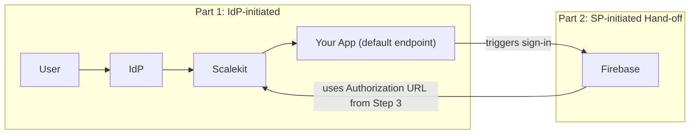

import { Tabs, TabItem, Steps } from '@astrojs/starlight/components';

IdP-initiated SSO allows users to log into your application directly from their identity provider's portal. The workflow consists of three main steps:

1. The user logs into their identity provider portal and selects your application
2. The identity provider sends the user's details as assertions to your application
3. Your application validates the assertions, retrieves the user information, and if everything checks out, logs the user in

<figure>
  
</figure>

Since the login is initiated from the identity provider's portal, this flow is called IdP-initiated SSO.

To securely implement IdP-initiated SSO, follow these steps to convert incoming IdP-initiated requests to SP-initiated flows:

<Steps>

1. **Set up a default redirect endpoint**: When Scalekit receives an IdP-initiated SSO request, it sends a request to your configured default `redirect_uri` with an `idp_initiated_login` parameter.

   ```sh showLineNumbers=false  "idp_initiated_login=<encoded_jwt_token>" wrap
   https://{your-subdomain}.scalekit.dev/default-redirect-uri?idp_initiated_login=<encoded_jwt_token>
   ```

2. **Extract information from the JWT token**: The `idp_initiated_login` parameter contains a signed JWT with organization, connection, and user details.

   ```js showLineNumbers=false
   {
     "organization_id": "org_225336910XXXX588",
     "connection_id": "conn_22533XXXXX575236",
     "login_hint": "name@example.com",
     "exp": 1723042087,
     "nbf": 1723041787,
     "iat": 1723041787,
     "iss": "https://b2b-app.com"
   }
   ```

3. **Convert to SP-initiated flow**: Use the extracted parameters to initiate a new SSO request. Here are implementation examples:

   <div>
   <Tabs syncKey="tech-stack">
   <TabItem value="nodejs" label="Node.js">

   ```javascript showLineNumbers=false "idp_initiated_login"
   // 1. Default redirect URL is callback with JWT
   const { code, error_description, idp_initiated_login } = req.query;

     if (error_description) {
       return res.status(400).json({ message: error_description });
     }


   // 2. Decode the JWT
   if (idp_initiated_login) {

     const {
       connection_id,
       organization_id,
       login_hint,
       relay_state
     } = await scalekit.getIdpInitiatedLoginClaims(idp_initiated_login);

     let options = {};
     // Either ONE of the following properties
       options["connectionId"] = connection_id
       options["organizationId"] = organization_id
       options["loginHint"] = login_hint

       // 3. Generate Authorization URL
       const url = scalekit.getAuthorizationUrl(
         <redirect_uri>,
         options
       )
       return res.redirect(url);
     }
   ```

   </TabItem>
   <TabItem value="python" label="Python">

   ```python showLineNumbers "idp_initiated_login"
   # 1. Default redirect URL is callback with JWT
   code = request.args.get('code')
   error_description = request.args.get('error_description')
   idp_initiated_login = request.args.get('idp_initiated_login')
   options = AuthorizationUrlOptions()


   if error_description:
       # Handle Error

   # 2. Decode the JWT
   if idp_initiated_login:
       claims = await scalekit.get_idp_initiated_login_claims(idp_initiated_login)
       connection_id = claims.get('connection_id', None)
       organization_id = claims.get('organization_id', None)
       login_hint = claims.get('login_hint', None)
       relay_state = claims.get('relay_state', None)
       options.connection_id=connection_id
       options.state=relay_state

       # 3. Generate Authorization URL
       authorization_url = scalekit.get_authorization_url(
         redirect_uri=redirect_uri,
         options=options
       )

       return redirect(url)
   ```

   </TabItem>
   <TabItem value="golang" label="Go">

   ```go showLineNumbers "idp_initiated_login"
   // 1. Default redirect URL is callback with JWT
   code := r.URL.Query().Get("code")
   err_description := r.URL.Query().Get("error_description")
   if err_description != "" {
       http.Error(w, err_description, http.StatusBadRequest)
       return
   }

   // 2. Decode the JWT
   if idpInitiatedLogin := r.URL.Query().Get("idp_initiated_login"); idpInitiatedLogin != "" {
     claims, err := a.scalekit.GetIdpInitiatedLoginClaims(idpInitiatedLogin)
     if err != nil {
       http.Error(w, err.Error(), http.StatusInternalServerError)
       return
     }

     // 3. Generate Authorization URL
     options := scalekit.AuthorizationUrlOptions{
       // Either ONE of the following properties
       ConnectionId:   claims.ConnectionID,
       OrganizationId: claims.OrganizationID,
       LoginHint:      claims.LoginHint,
     }
     authUrl, err := a.scalekit.GetAuthorizationUrl(a.redirectUrl, options)

     if err != nil {
       http.Error(w, err.Error(), http.StatusInternalServerError)
       return
     }
     http.Redirect(w, r, authUrl.String(), http.StatusFound)
   }
   ```

   </TabItem>
   <TabItem value="java" label="Java">

   ```java showLineNumbers=false wrap "idp_initiated_login"
   // 1. Default redirect URL is callback with JWT
   @GetMapping("/callback")
   public RedirectView callbackHandler(
       @RequestParam(required = false) String code,
       @RequestParam(required = false,
           name = "error_description") String errorDescription,
       @RequestParam(required = false,
           name = "idp_initiated_login") String idpInitiatedLoginToken,

       HttpServletResponse response) throws IOException {
     if (errorDescription != null) {
       // Handle Errors
       }

     // 2. Decode the JWT
     if (idpInitiatedLoginToken != null) {
       IdpInitiatedLoginClaims idpInitiatedLoginClaims =
           scalekit.authentication().getIdpInitiatedLoginClaims(
               idpInitiatedLoginToken);
       if (idpInitiatedLoginClaims == null) {
         response.sendError(HttpStatus.BAD_REQUEST.value(),
             "Invalid idp_initiated_login token");
         return null;
       }
       // Either ONE of the following
       AuthorizationUrlOptions options = new AuthorizationUrlOptions();
       if (idpInitiatedLoginClaims.getConnectionID() != null) {
         options.setConnectionId(idpInitiatedLoginClaims.getConnectionID());
       }
       if (idpInitiatedLoginClaims.getOrganizationID() != null) {
         options.setOrganizationId(idpInitiatedLoginClaims.getOrganizationID());
       }
       if (idpInitiatedLoginClaims.getLoginHint() != null) {
         options.setLoginHint(idpInitiatedLoginClaims.getLoginHint());
       }

       // 3. Generate Authorization URL
       String url = scalekit.authentication()
                       .getAuthorizationUrl(redirectUrl, options)
                       .toString();
       response.sendRedirect(url);
       return null;
     }
   ```

   </TabItem>
   </Tabs>
   </div>

4. **Handle errors**: If errors occur, the redirect URI will receive a callback with error information. See the <a href="/reference/errors/" target="_blank">error handling</a> guide for more details.

   ```sh showLineNumbers=false wrap
   https://{your-subdomain}.scalekit.dev/callback
     ?error="<error_category>"
     &error_description="<details>"
   ```

</Steps>

## Integrating with a Downstream Auth Provider

If your application uses a third-party service like [Firebase Authentication](/guides/integrations/auth-systems/firebase/) to manage user sessions, you must initiate its sign-in flow after completing **Step&nbsp;3**.

This process has two stages: first, the IdP redirects the user to your app via Scalekit, and second, your app triggers a new sign-in flow with Firebase using the Authorization URL you just generated.



The example below shows how to pass the Authorization URL to the Firebase Web SDK.

<Tabs syncKey="downstream-auth">
<TabItem value="firebase-js" label="Firebase (Web SDK)">

```javascript
import { getAuth, OAuthProvider, signInWithRedirect } from "firebase/auth";

const auth = getAuth();

// "scalekit" is the OIDC provider you configured in Firebase.
const scalekitProvider = new OAuthProvider("scalekit");

// This is the `authorizationUrl` from Step 3.
scalekitProvider.setCustomParameters({
  authorization_url: authorizationUrl,
});

signInWithRedirect(auth, scalekitProvider);
```

</TabItem>
</Tabs>

This pattern applies to other OIDC-compatible providers like Auth0 or AWS Cognito. Simply supply the Authorization URL from **Step&nbsp;3** to start the provider's standard sign-in flow.

## Troubleshooting

If you encounter issues implementing IdP-initiated SSO:

1. Verify your redirect URI is properly configured in the Scalekit Dashboard
2. Check that you're correctly processing the JWT token from the `idp_initiated_login` parameter
3. Ensure your error handling properly captures and processes any error messages

## Benefits of this approach

The advantages of using Scalekit's approach are:

- **Enhanced security**: Overcomes the security risks of handling IdP-initiated SSO
- **Seamless experience**: The additional redirect is almost instantaneous, providing a smooth user experience

## Security considerations

While IdP-initiated SSO offers convenience, it comes with significant security risks:

### Potential security risks

**Stolen SAML assertions**: Attackers can steal SAML assertions and use them to gain unauthorized access. If an attacker manages to steal these assertions, they can:

- Inject them into another service provider, gaining access to that user's account
- Inject them back into your application with altered assertions, potentially elevating their privileges

With a stolen SAML assertion, an attacker can gain access to your application as the compromised user, bypassing the usual authentication process.

### How attackers steal SAML assertions

Attackers can steal SAML assertions through various methods:

- **Man-in-the-middle (MITM) attacks**: Intercepting and replacing the SAML response during transmission
- **Open redirect attacks**: Exploiting improper endpoint validation to redirect the SAML response to a malicious server
- **Leaky logs and headers**: Sensitive information, including SAML assertions, can be leaked through logs or headers
- **Browser-based attacks**: Exploiting browser vulnerabilities to steal SAML assertions

### The challenge for service providers

The chief problem with stolen assertions is that everything appears legitimate to the service provider (your application). The message and assertion are valid, issued by the expected identity provider, and signed with the expected key. However, the service provider cannot verify whether the assertions are stolen or not.
